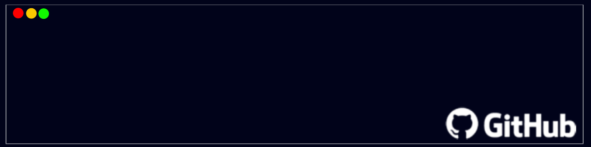

I am a highly motivated individual with a passion for coding and problem-solving. With experience in various programming languages and frameworks, I am a quick learner, a team player, and I really enjoy to <b>code</b>.

<h2>Stats</h2>
 

    
    

        

<h2>Contact</h2>
<h5>
  
</h5>
